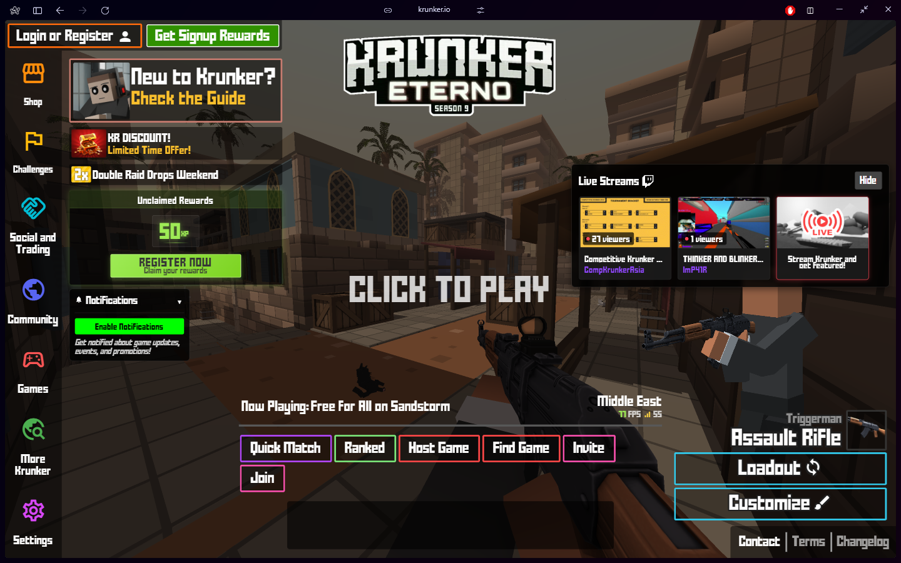
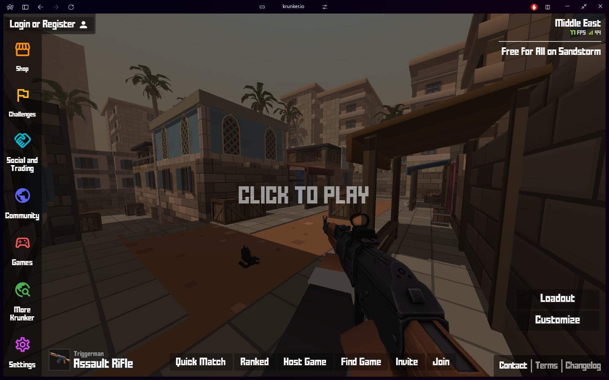
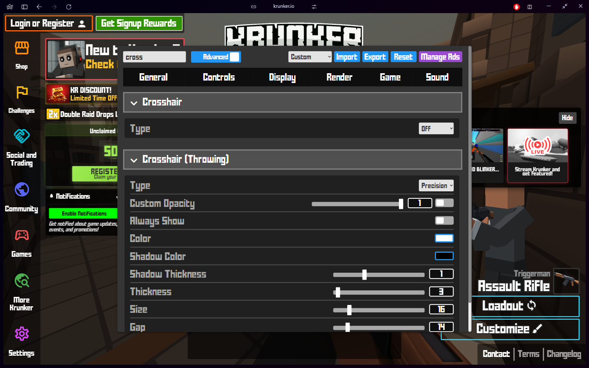
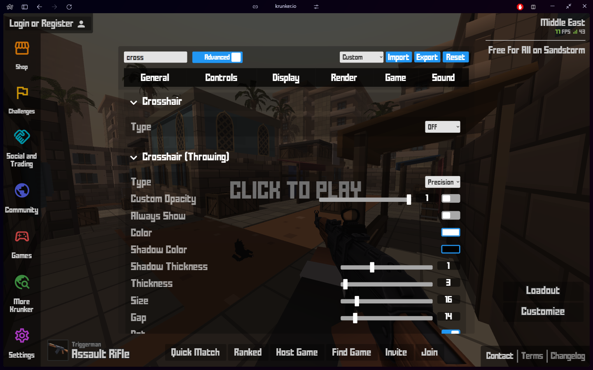
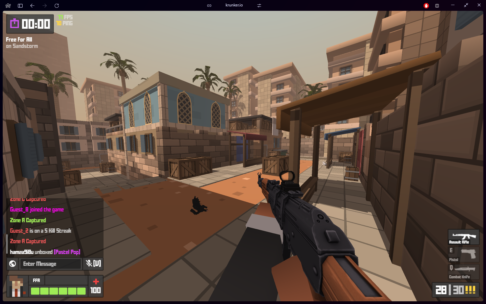
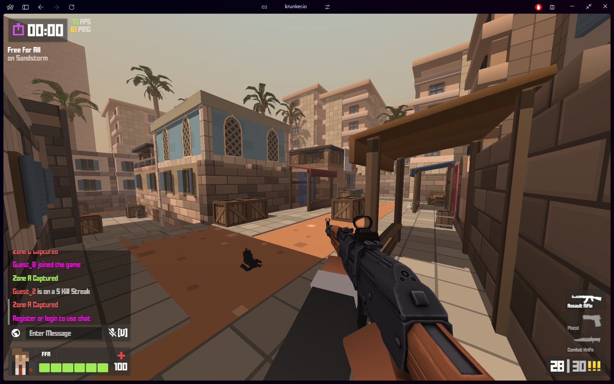

## removal.css

> [krunker.io](krunker.io) ui made better

## Features

- removes ads and visual clutter
- improves FPS (less rendering load)
- gives the UI a clean look

## Installation

Add the following line to the **very top** of your `main_custom.css`:

```css
@import url("https://envyxyz.github.io/removal/removal.css");
```

## Screenshots <span style="font-size:12px;font-style:italic;">(Before vs After)<span>

#### **Main Menu**

<div align="center">
 
</div>

---

#### **Settings**

<div align="center">
 
</div>

---

#### **In-game UI**

<div align="center">
 
</div>

---

## Contact

- twitter: [@envyxyz7](https://twitter.com/envyxyz7)
- discord: envyxyz7

## made in


